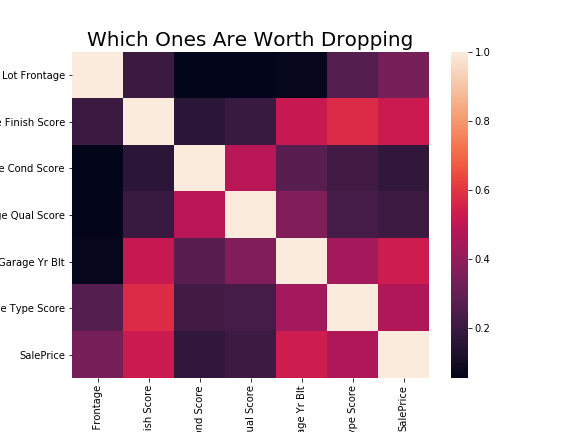
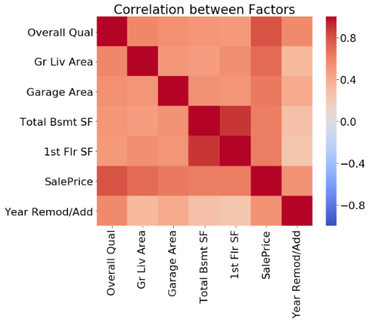
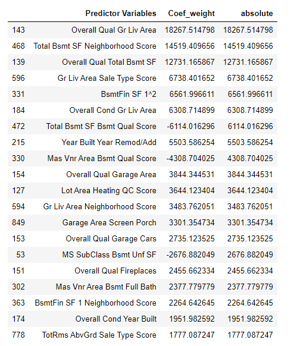
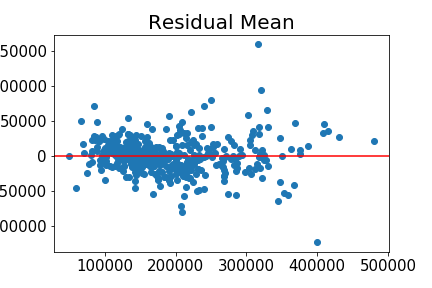
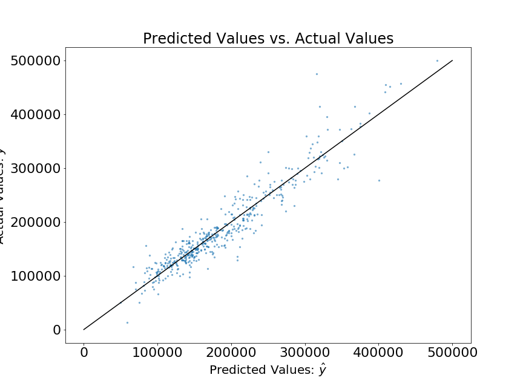
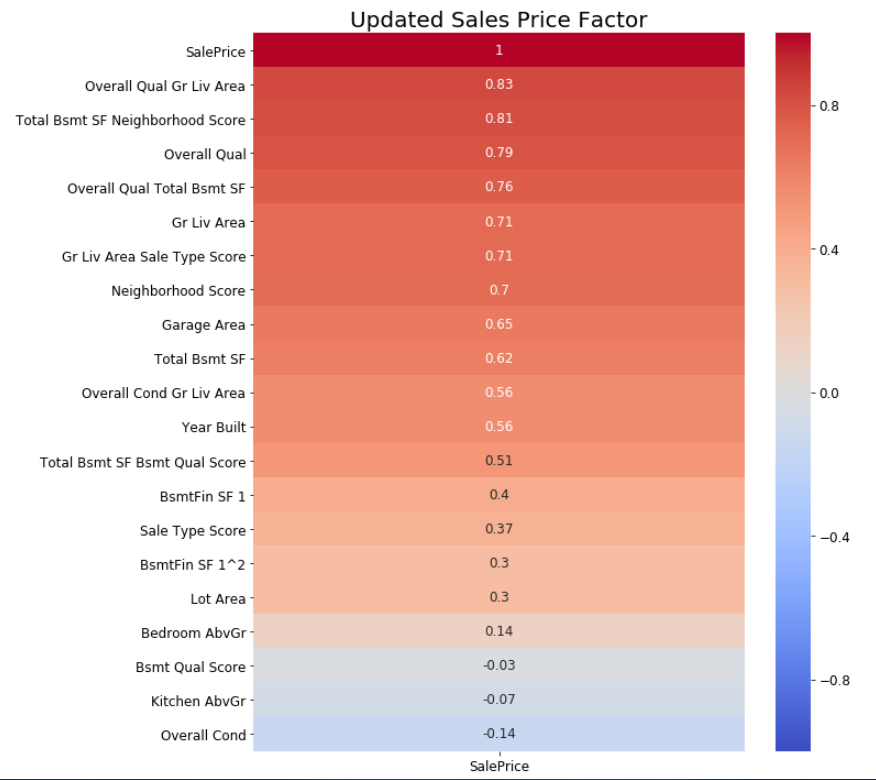

# Ames Housing Data analysis

 ## For this project we are given Ames Housing Data from 2006 to 2010, given the data, we are able to see as an app company, how can we have model to determin the house value and is ther anything we can do with it.

The reason an app company can be benefit from it is because periodically company needs to remodel their price model to give an better idea. During resession time, year is an important factor; for new area, construction might be a factor, and for mixed area, location is always important

## Data Cleaning

For this Data set, we are given 81 factors we can choose from, covering veriaty of values, from housing type, year build, year sold, to house condition, basement type, structure. There are some missing data, I dropped the one with over 1000 missing data given the data is 2051 total. For the remaining missing ones, I use a heatmap to drop two unimportant column, and dropped the rest of 5% rows



Dropped Garage Cond and Garage Qual based on the heatmap, the remaing is 5% of 2051 data, so I deleted the 5% rows

After Cleaning Data, columns with catogy I mapped them to scores(numbers) to have a better meaturement. For Example the housing condition, I assign scores from 1 to 5 to "Gd",'TA', 'EX', 'FA' and 'PO' based on group them with Sales price

For numeric data, I did correlationship heatmap to get an idea which ones are worth work with, and roughly come up with the heatmap below:



I dropped one of those two highly related colum and begin to feature engineer the interaction terms with polinomial and filted with lazzo, to get the most weighted coefficient list



I tested my scores and errors:
 - cross_val_score: 0.89
 - R2 for tranning data: 0.91
 - R2 for holdout data: 0.90
 - Residual Mean: 35



## Prediction vs Actual：



## Proposed Price determine Factors



Summary
We can not tell Ames is affected by 2008 Recession	
Housing is mainly based on housing quality, basement and neighbourhood 
Combined features sometime bring more value to the house

Recommendation

 - To better understand the housing insights, we need to breakdown Overall Quality in the given information
 - For company, we can show features on the front page along with house pictures to gain user loyalty
 - Use updated feature show users housing prediction
 - Get partnership with remodel companies to bring company more profit

```python

```
